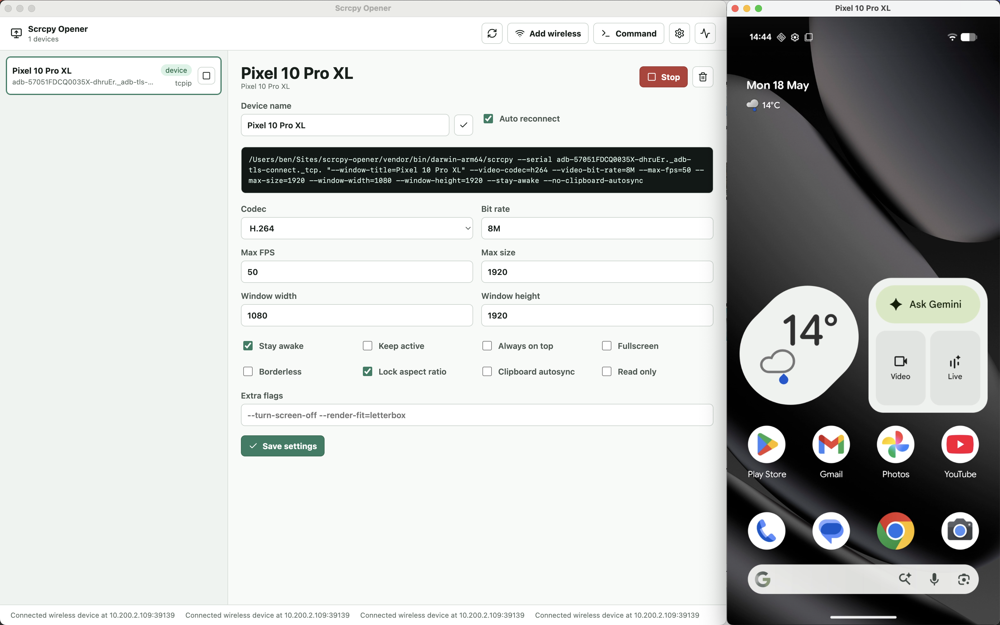

# Scrcpy Opener

Scrcpy Opener is a desktop control panel for launching named
[`scrcpy`](https://github.com/Genymobile/scrcpy) windows against Android devices.
It is designed primarily for event product demos, where teams need stable,
clearly named Android screen windows that can be captured into video production
software such as OBS, vMix, Ecamm, StreamYard, or other window-capture tools.

Instead of hand-running `adb` and `scrcpy` commands during a live demo, Scrcpy
Opener lets you connect devices, name them, tune capture settings, and open or
stop the matching scrcpy window from one app.



Scrcpy Opener running beside a named Android scrcpy window, ready for window
capture in OBS or other production software.

## What It Does

- Lists connected and remembered Android Debug Bridge devices.
- Opens each device in a scrcpy window with a predictable window title.
- Lets you rename devices so capture software can target readable names like
  `Stage Phone`, `Tablet Demo`, or `Backup Device`.
- Supports global scrcpy defaults and per-device overrides.
- Supports USB devices, Android wireless debugging QR pairing, manual wireless
  pairing, and USB-assisted TCP/IP wireless setup.
- Resolves Android wireless debugging mDNS device names and connects scrcpy to
  the direct device IP for a more stable capture connection.
- Can auto reconnect devices and relaunch scrcpy after a disconnect.
- Shows the exact scrcpy command before launch.
- Includes a small manual console for safe `adb`, `scrcpy`, and `clear`
  commands.
- Includes logs and diagnostics for adb/scrcpy path and version checks.
- Bundles pinned adb and scrcpy binaries for quick deployment on demo machines.
- Can package macOS and Windows builds with those bundled tools included.

## Why This Exists

For live demos, screen capture needs to be boring and repeatable. OBS and
similar tools are much easier to operate when every Android device opens in a
known, stable window with a human-readable title.

Scrcpy Opener sits between ADB, scrcpy, and your production software. The app is
not a replacement for scrcpy; it is a practical launcher and device manager for
demo environments where timing, naming, reconnects, and capture settings matter.
For wireless devices, it also resolves Android's mDNS service names to direct IP
connections so capture sessions are less dependent on fragile service-name
aliases.

## Typical Event Demo Workflow

1. Connect or pair the Android devices.
2. Rename each device in Scrcpy Opener to match its role in the show.
3. Configure global or per-device scrcpy settings.
4. Click `Open` for each device.
5. In OBS or other video software, add a window capture source for each named
   scrcpy window.
6. Enable auto reconnect for devices that should recover after cable or Wi-Fi
   interruptions.

## Requirements

- macOS or Windows.
- Node.js and npm for development.
- Android devices with USB debugging or wireless debugging enabled.
- `adb` and `scrcpy`.

For packaged builds, this project can bundle pinned adb and scrcpy binaries so
demo machines do not need a separate Android platform-tools or scrcpy setup.
During development, the app falls back to `adb` and `scrcpy` on your `PATH` if
bundled tools are not present.

## Getting Started

Install dependencies:

```bash
npm install
```

Run the app in development mode:

```bash
npm run dev
```

Run tests:

```bash
npm test
```

Build the Electron app:

```bash
npm run build
```

Package distributables:

```bash
npm run package
```

Build Windows targets:

```bash
npm run package:win
```

## Bundled Vendor Tools

Before packaging, download the pinned vendor binaries:

```bash
npm run vendor:download
```

The vendor script downloads:

- scrcpy `v4.0`
- Android platform-tools `37.0.0`

The files are placed in `vendor/bin`, which is ignored by git and included in
Electron Builder `extraResources`.

This makes the packaged app easier to deploy to event laptops because adb and
scrcpy travel with the application instead of depending on each machine's local
developer environment.

## Documentation

- [Usage Guide](docs/USAGE.md)
- [Development Guide](docs/DEVELOPMENT.md)

## Project Status

Scrcpy Opener is early open-source software. The current target is practical
macOS and Windows usage for product demo, event, and video production workflows.

## Credits

Built by Ben.

Documentation and open-source project preparation assisted by OpenAI Codex.

Scrcpy Opener builds on the excellent work of the
[`scrcpy`](https://github.com/Genymobile/scrcpy) project and the Android
platform-tools project.

## License

MIT. See [LICENSE](LICENSE).
